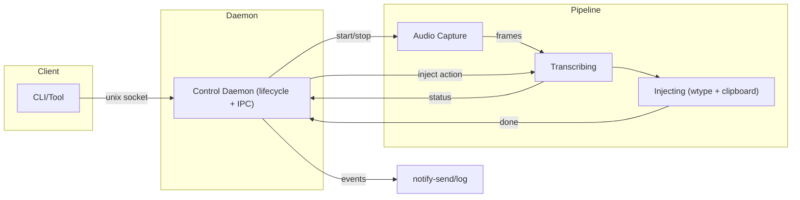
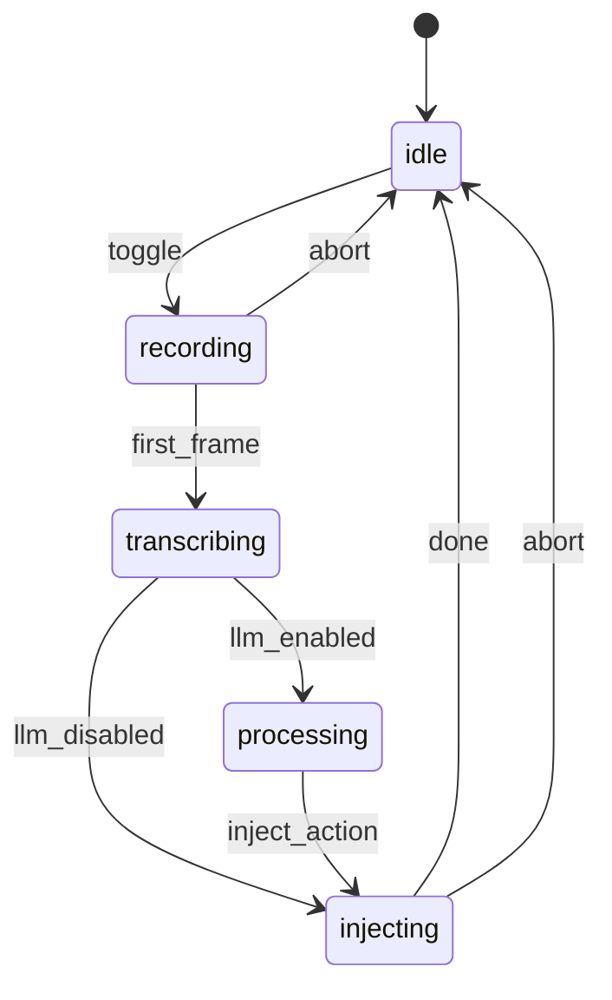

# Hyprvoice (Fork) - WhisperFlow Alternative for Linux | Voice Dictation for Arch Linux, CachyOS & Wayland

> **The best open-source voice-to-text dictation tool for Linux** - A WhisperFlow alternative that actually works on Linux with auto-paste support. Speak and your words appear instantly, just like macOS dictation.

**This is a fork of [LeonardoTrapani/hyprvoice](https://github.com/LeonardoTrapani/hyprvoice)** with clipboard auto-paste and terminal-aware paste support. The original project copies text to clipboard but requires manual paste — this fork automatically pastes into the focused window, matching the seamless experience of WhisperFlow on macOS.

## Why This Fork?

If you've been searching for a **WhisperFlow alternative on Linux**, a **dictation tool for Arch Linux**, or **voice typing for Wayland** — you know the pain. macOS has built-in dictation and WhisperFlow, Windows has voice typing, but Linux users were left with half-working solutions that copy text but don't paste it.

**This fork solves that.** After transcription completes:
- Text is copied to clipboard via `wl-copy`
- A paste keystroke is automatically simulated (Ctrl+V or Ctrl+Shift+V for terminals)
- Terminal detection works on **KDE Plasma** (via KWin DBus) and **Hyprland** (via hyprctl)
- Falls back gracefully — if auto-paste fails, text is still in your clipboard

It works like WhisperFlow on Mac, but for Linux. Open source. Free.

## Search Keywords

Voice dictation Linux, speech-to-text Linux, WhisperFlow Linux alternative, WhisperFlow replacement, voice typing Arch Linux, voice typing CachyOS, dictation tool Ubuntu, dictation tool Fedora, Linux Mint voice input, voice to text Wayland, voice to text KDE Plasma, Hyprland dictation, speech recognition Linux desktop, hands-free typing Linux, accessibility voice input Linux, open source dictation, macOS dictation alternative Linux, whisper voice typing, AI transcription Linux desktop, PipeWire voice capture, voice input Manjaro, voice typing EndeavourOS, Garuda Linux dictation, NixOS voice input.

---

## Highlights

- **26 speech-to-text models** across cloud and local providers, including whisper.cpp
- **Auto-paste into any application** — terminals, browsers, editors, chat apps (fork feature)
- **Terminal-aware paste** — detects KDE Konsole, kitty, Alacritty, foot, Ghostty, WezTerm, and 20+ terminals (fork feature)
- **Injection success notification** — desktop notification confirms text was injected (fork feature)
- Optional LLM post-processing for grammar, punctuation, filler word removal, and more
- Toggle workflow with status notifications and cancel support
- Text injection via ydotool, wtype, and clipboard with auto-paste fallback chain
- Guided onboarding and a full configure menu with hot-reload
- Personalization through custom prompt and keywords sent to both LLM and voice model
- Support for streaming models for blazing-fast transcription
- **Works on**: Arch Linux, CachyOS, Manjaro, EndeavourOS, Garuda Linux, Ubuntu, Fedora, Linux Mint, Debian, NixOS, openSUSE — any distro with Wayland and PipeWire

## What's Different From Upstream?

| Feature | Upstream | This Fork |
|---------|----------|-----------|
| Clipboard copy | Copies text, user pastes manually | Copies + auto-pastes into focused window |
| Terminal paste | N/A | Detects terminals, uses Ctrl+Shift+V |
| KDE Plasma support | Clipboard only | Full auto-paste with KWin window detection |
| Hyprland support | Clipboard only | Full auto-paste with hyprctl window detection |
| Injection notification | None | Desktop notification on success |

## Voice Providers and Models

All supported speech-to-text providers and models:

### OpenAI (cloud)

- `whisper-1` (batch)
- `gpt-4o-transcribe` (batch)
- `gpt-4o-mini-transcribe` (batch)
- `gpt-4o-realtime-preview` (streaming)

### Groq (cloud)

- `whisper-large-v3`
- `whisper-large-v3-turbo`

### Mistral (cloud)

- `voxtral-mini-latest`

### ElevenLabs (cloud)

- `scribe_v1` (batch)
- `scribe_v2` (batch)
- `scribe_v2_realtime` (streaming)

### whisper-cpp (local)

- English-only: `tiny.en`, `base.en`, `small.en`, `medium.en`
- Multilingual: `tiny`, `base`, `small`, `medium`, `large-v1`, `large-v2`, `large-v3`, `large-v3-turbo`

### Deepgram (cloud)

- `flux-general-en`
- `nova-3`
- `nova-2`

## Installation

### From Source (this fork)

```bash
git clone https://github.com/burakgizlice/hyprvoice.git
cd hyprvoice
go build -o hyprvoice ./cmd/hyprvoice
sudo cp hyprvoice /usr/bin/hyprvoice
```

### AUR (upstream version, without auto-paste)

```bash
yay -S hyprvoice-bin
# or
paru -S hyprvoice-bin
```

### Dependencies

- **PipeWire** — audio capture
- **wl-clipboard** (`wl-copy`) — clipboard operations
- **wtype** or **ydotool** — auto-paste keystroke simulation
- **qdbus6/qdbus** (KDE Plasma) or **hyprctl** (Hyprland) — terminal detection (optional)

## Quick Start

1. Run onboarding:

```bash
hyprvoice onboarding
```

2. Enable and start the service:

```bash
systemctl --user enable --now hyprvoice.service
```

3. Add a keybinding (Hyprland example):

```bash
bind = SUPER, R, exec, hyprvoice toggle
```

KDE Plasma users: bind `hyprvoice toggle` to any shortcut via System Settings > Shortcuts > Custom Shortcuts.

4. Test voice input:

```bash
hyprvoice toggle
```

Run `hyprvoice configure` anytime for advanced settings.

## How Auto-Paste Works

1. You press your toggle key and speak
2. Press toggle again — audio is transcribed via your chosen provider
3. Transcribed text is copied to clipboard via `wl-copy`
4. After a 50ms settle delay, a paste keystroke is simulated:
   - **Terminal detected** (Konsole, kitty, Alacritty, etc.) → `Ctrl+Shift+V`
   - **GUI app** (browser, editor, chat) → `Ctrl+V`
5. Paste simulation tries `wtype` first, falls back to `ydotool` (raw keycodes)
6. If everything fails, text is still in your clipboard — paste manually

### Supported Terminals

kitty, Alacritty, foot, WezTerm, Ghostty, Konsole (org.kde.konsole), GNOME Terminal, Xfce Terminal, Terminator, Tilix, Sakura, st, urxvt, xterm, Rio, Contour, BlackBox, and more.

### Compositor Support for Terminal Detection

- **KDE Plasma 5/6**: Uses KWin scripting via DBus (`qdbus6`/`qdbus`) to query active window class
- **Hyprland**: Uses `hyprctl activewindow -j` to query active window class
- **Other compositors**: Auto-paste still works, but terminal detection falls back to Ctrl+V (you can paste manually in terminals with Ctrl+Shift+V)

## Commands

### Core CLI

```bash
hyprvoice onboarding
hyprvoice configure
hyprvoice serve
hyprvoice toggle
hyprvoice cancel
hyprvoice status
hyprvoice version
hyprvoice stop
```

### Model management (whisper-cpp)

```bash
hyprvoice model list
hyprvoice model list --provider whisper-cpp
hyprvoice model download base.en
hyprvoice model remove base.en
```

### Model testing (E2E)

```bash
hyprvoice test-models
hyprvoice test-models --audio /path/to/sample.wav --output test-models.json
```

### Service management

```bash
systemctl --user status hyprvoice.service
systemctl --user restart hyprvoice.service
journalctl --user -u hyprvoice.service -f
```

## Configuration

Configuration lives in `~/.config/hyprvoice/config.toml` and hot-reloads automatically.

- First-time setup: `hyprvoice onboarding`
- Full TUI editor: `hyprvoice configure`

### Recommended config for auto-paste (this fork)

Set clipboard as your primary (or only) injection backend in `config.toml`:

```toml
[injection]
backends = ["clipboard"]
clipboard_timeout = "5s"
```

## Docs

- `docs/config.md` - configuration reference and examples
- `docs/providers.md` - provider and model details
- `docs/architecture.md` - architecture and adapter overview
- `docs/structure.md` - code map and entry points
- `docs/testing.md` - integration testing with test-models

## Troubleshooting

### Common Issues

#### Daemon Issues

**Daemon won't start:**

```bash
# Check if already running
hyprvoice status

# Check for stale files
ls -la ~/.cache/hyprvoice/

# Clean up and restart
rm -f ~/.cache/hyprvoice/hyprvoice.pid
rm -f ~/.cache/hyprvoice/control.sock
hyprvoice serve
```

**Command not found:**

```bash
# Check installation
which hyprvoice

# Add to PATH if using ~/.local/bin
echo 'export PATH="$HOME/.local/bin:$PATH"' >> ~/.bashrc
source ~/.bashrc
```

#### Audio Issues

**No audio recording:**

```bash
# Check PipeWire is running
systemctl --user status pipewire

# Test microphone
pw-record --help
pw-record test.wav

# Check microphone permissions and levels
```

**Audio device issues:**

```bash
# List available audio devices
pw-cli list-objects | grep -A5 -B5 Audio

# Check microphone is not muted in system settings
```

#### Auto-Paste Issues (Fork-Specific)

**Auto-paste not working:**

```bash
# Check if wtype or ydotool is installed
which wtype ydotool

# Check daemon logs for paste errors
journalctl --user -u hyprvoice.service -n 20 --no-pager | grep clipboard

# Test wtype directly
wtype "test"

# Test ydotool paste (Ctrl+V via raw keycodes)
ydotool key 29:1 47:1 47:0 29:0
```

**Terminal detection not working (KDE Plasma):**

```bash
# Verify qdbus6 is installed
which qdbus6

# Test KWin window query manually
qdbus6 org.kde.KWin /Scripting org.kde.kwin.Scripting.loadScript /dev/stdin hyprvoice_test <<< 'console.log(workspace.activeWindow.resourceClass);'
```

**Pastes old clipboard content:**

This typically means the 50ms settle delay isn't enough. The clipboard backend waits for the compositor to register the new content before pasting. If you experience this, the text is still copied correctly — just paste manually.

#### Notification Issues

**No desktop notifications:**

```bash
# Test notify-send directly
notify-send "Test" "This is a test notification"

# Install if missing
sudo pacman -S libnotify  # Arch
sudo apt install libnotify-bin  # Ubuntu/Debian
```

#### Text Injection Issues

**Text not appearing:**

- Ensure cursor is in a text field when toggling off recording
- Check that `wtype` and `wl-clipboard` tools are installed:

  ```bash
  # Test wtype directly
  wtype "test text"

  # Test clipboard tools
  echo "test" | wl-copy
  wl-paste
  ```

- Verify Wayland compositor supports text input protocols
- Check injection backends in configuration (fallback chain is most robust)

### Debug Mode

```bash
# Run daemon with verbose output
hyprvoice serve

# Check logs from systemd service (or just see results from hyprvoice serve)
journalctl --user -u hyprvoice.service -f

# Test individual commands
hyprvoice toggle
hyprvoice status
```

## Architecture Overview

Hyprvoice uses a **daemon + pipeline** architecture for efficient resource management:

- **Control Daemon**: Lightweight IPC server managing lifecycle
- **Pipeline**: Stateful audio processing (recording → transcribing → processing → injecting)
- **State Machine**: `idle → recording → transcribing → processing → injecting → idle`

### System Architecture





### How It Works

1. **Toggle recording** → Pipeline starts, audio capture begins
2. **Audio streaming** → PipeWire frames buffered for transcription
3. **Toggle stop** → Recording ends, transcription starts
4. **LLM processing** → Text cleaned up (if enabled)
5. **Text injection** → Result auto-pasted or copied to clipboard
6. **Return to idle** → Pipeline cleaned up, ready for next session

### Data Flow

1. `toggle` (daemon) → create pipeline → recording
2. First frame arrives → transcribing (daemon may notify `Transcribing` later)
3. Audio frames → audio buffer (collect all audio during session)
4. Second `toggle` during transcribing → transcribe collected audio
5. If LLM enabled → processing → clean up text with LLM
6. injecting → copy to clipboard + auto-paste into focused window
7. Complete → idle; pipeline stops; daemon clears reference
8. Notifications at key transitions (including "Text Injected" on success)

## Credits

This is a fork of [LeonardoTrapani/hyprvoice](https://github.com/LeonardoTrapani/hyprvoice). All credit for the core architecture, pipeline design, provider integrations, and CLI goes to the original author. This fork adds clipboard auto-paste, terminal detection, and injection success notifications.

## License

MIT License - see [LICENSE.md](LICENSE.md) for details.
